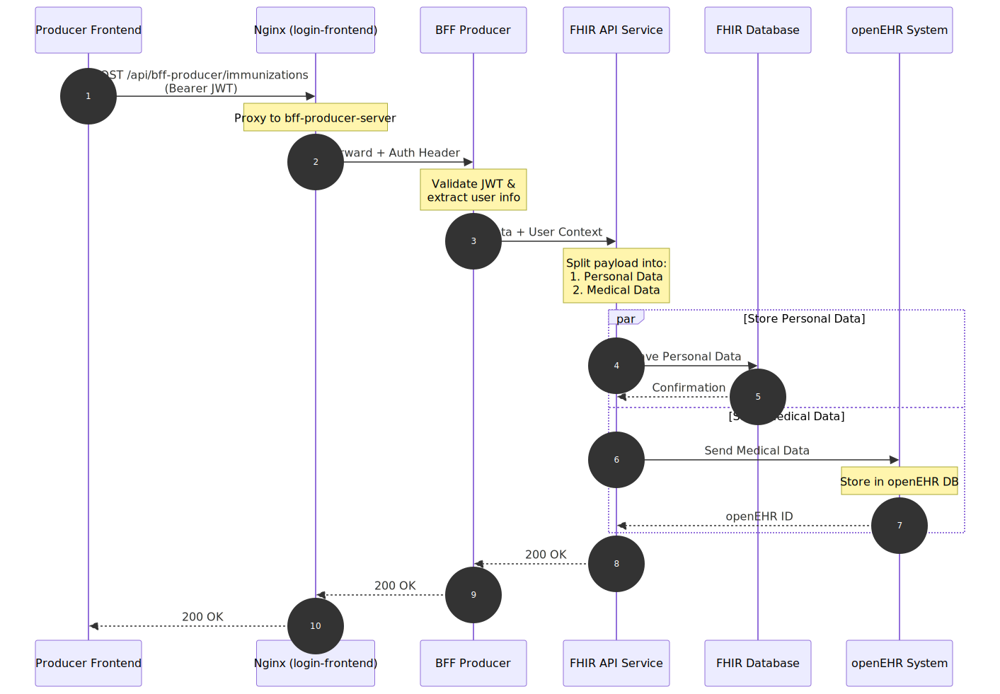
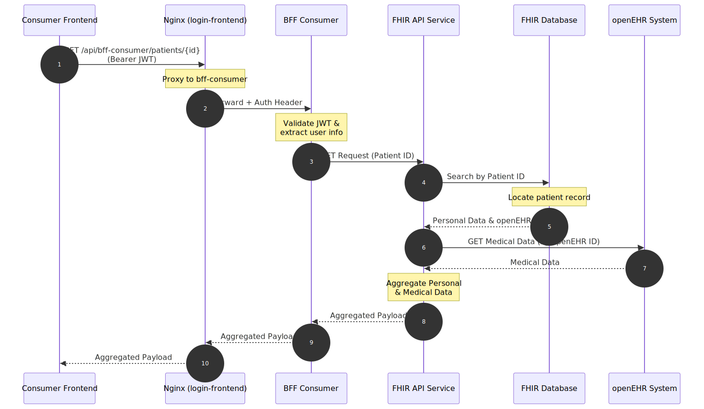
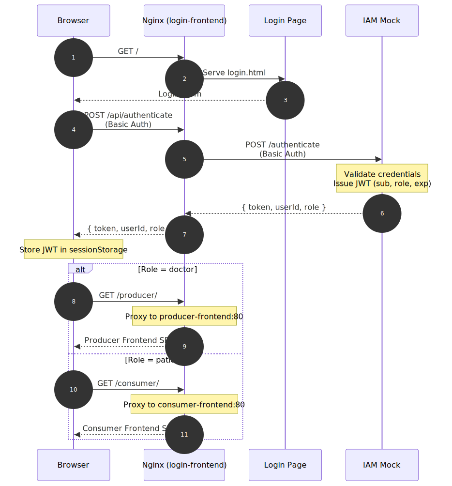

# Digitale Patientenakte – Architektur-Spezifikation

## Übersicht

Dieses Dokument beschreibt das Architekturschema und den Datenfluss der digitalen Patientenakte. Das System folgt einem strikten **Backend-for-Frontend (BFF)**-Muster, um client-spezifische Logik zu isolieren, sowie einer zentralen Orchestrierungsschicht, die persönliche demografische Daten von klinischen medizinischen Daten trennt.

Die gesamte Kommunikation zwischen Frontend und Backend läuft über einen zentralen **Nginx-Reverse-Proxy** (Single Entry Point), der CORS-Probleme vermeidet und die Dienste transparent routet. Die Authentifizierung erfolgt über einen **IAM Mock**, der Benutzername/Passwort gegen eine JWT-Ausstellung prüft.

Durch die Kombination von **FHIR** für Patientenidentitäten und persönlichen Daten sowie **openEHR** für strukturierte klinische Daten wird höchste Datensicherheit, regulatorische Konformität und modulare Skalierbarkeit gewährleistet.

---

## 1. Systemarchitektur

Das strukturelle Design entkoppelt die Client-Anwendungen vollständig von den zugrunde liegenden Gesundheitsspeichern. Der Nginx-Reverse-Proxy im `login-frontend` fungiert als einziger Einstiegspunkt (Port 3003) und routet Anfragen an die jeweiligen Dienste.

### Architektonische Entscheidungen:

* **Single Entry Point (Nginx):** Der gesamte Datenverkehr läuft über `localhost:3003`. Nginx routet statische Frontends, API-Aufrufe und Authentifizierungsanfragen an die jeweils zuständigen Container. Dies vermeidet CORS-Probleme, da alle Anfragen vom selben Origin kommen.
* **IAM Mock:** Ein einfacher JWT-Ausstellungsdienst für die Entwicklung. Benutzer authentifizieren sich via Basic Auth und erhalten ein signiertes JWT (`sub`, `role`, `exp`). Es stehen vier Patienten (`patient1`–`patient4`) und ein Arzt (`doctor1`) zur Verfügung.
* **Backend-for-Frontend (BFF):** Dedizierte Backend-Dienste werden für das `Producer-Frontend` (Arzt) und das `Consumer-Frontend` (Patient) bereitgestellt. Dies ermöglicht maßgeschneiderte REST-APIs für jede Benutzeroberfläche, optimiert die Datenübertragung (Payloads) und übernimmt die Validierung von Authentifizierungstoken, bevor Anfragen die Kern-Services erreichen.
* **FHIR-API-Service als Orchestrator:** Dieser zentrale Dienst fungiert als Router und Aggregationsschicht. Er verhindert, dass die BFFs die Komplexität der zugrunde liegenden Datenbanktopologien verwalten müssen.
* **Separation of Concerns (Trennung von Belangen):** Persönliche Daten (PII) werden strikt in der FHIR-Datenbank gespeichert, während medizinische Daten (z. B. Impfdaten) im openEHR-System abgelegt werden. Der FHIR-Datensatz stellt die Verknüpfung über eine eindeutige `openEHR-ID` her.

---

## 2. Schreib-Datenfluss: Erfassung von Impfdaten

Wenn ein Producer (z. B. ein Arzt oder ein klinisches System) einen Impfdatensatz übermittelt, trennt das System die eingehende Nutzlast auf, um sicherzustellen, dass klinische Daten sauber von identifizierbaren persönlichen Daten isoliert werden.

### Details zum Ablauf:

1. **Login:** Der Benutzer (Arzt) meldet sich über die Login-Seite an. Nginx leitet `POST /api/authenticate` an den IAM Mock weiter. Bei Erfolg wird ein JWT ausgestellt und der Benutzer auf `/producer/` umgeleitet, wo Nginx das Producer-Frontend ausliefert.
2. **Erfassung & Authentifizierung:** Das Producer-Frontend übermittelt die Impfdaten via `POST /api/bff-producer/immunizations`. Nginx proxied die Anfrage an den BFF-Producer-Dienst. Dieser validiert das JWT, extrahiert den Benutzerkontext und leitet die Anfrage an den FHIR-API-Service weiter.
3. **Payload-Splitting (Aufteilung der Nutzlast):** Die zentrale Geschäftslogik liegt im FHIR-API-Service, welcher die JSON-Nutzlast in persönliche Identifikatoren und klinische Beobachtungen aufteilt.
4. **Parallele Speicherung:**
   * Persönliche Daten werden direkt in der FHIR-Datenbank gesichert.
   * Medizinische Daten werden formatiert und an das openEHR-System übergeben.
5. **Referenz-Verknüpfung:** Das openEHR-System speichert die Daten und gibt eine interne `openEHR-ID` zurück. Der FHIR-Dienst aktualisiert anschließend den Identitätsdatensatz des Patienten, um ihn mit dieser neuen klinischen ID für zukünftige Abfragen zu verknüpfen.

---

## 3. Lese-Datenfluss: Abruf von Consumer-Daten

Damit ein Consumer (z. B. ein Patient) seine Akte einsehen kann, rekonstruiert das System das vollständige Profil, indem es beide Datenspeicher über die interne Verknüpfung abfragt. Dieser Vorgang bleibt für den Frontend-Client vollkommen transparent.

### Details zum Ablauf:

1. **Login:** Der Benutzer (Patient) meldet sich an. Nach erfolgreicher Authentifizierung über den IAM Mock wird er auf `/consumer/` umgeleitet, wo Nginx das Consumer-Frontend ausliefert.
2. **Anfrage-Initiierung:** Das Consumer-Frontend fordert Daten unter Verwendung einer bekannten `Patienten-ID` an. Der Request geht an `/api/bff-consumer/patients/{id}`, Nginx proxied an den BFF-Consumer. Dieser validiert das JWT und leitet die Anfrage an den FHIR-API-Service weiter.
3. **Identitätsauflösung:** Der FHIR-API-Service fragt die FHIR-Datenbank mit der `Patienten-ID` ab, um die persönlichen Daten des Benutzers abzurufen. Entscheidend ist, dass dieser Lookup auch die verknüpfte `openEHR-ID` liefert.
4. **Klinischer Abruf:** Unter Verwendung der aufgelösten `openEHR-ID` fragt der Dienst das openEHR-System ab und ruft die entsprechenden medizinischen Datensätze ab.
5. **Aggregation:** Der FHIR-API-Service führt die persönlichen und medizinischen Daten wieder in einem einheitlichen Data Transfer Object (DTO) zusammen. Diese aggregierte Nutzlast wird über den BFF und Nginx an den Consumer-Client zurückgegeben.

---

## 4. Gateway & Authentifizierung

Der Nginx-Reverse-Proxy (`login-frontend`, Port 3003) ist der zentrale Einstiegspunkt für alle Anfragen. Er bündelt die statischen Frontends, API-Dienste und den Authentifizierungsdienst unter einer gemeinsamen Origin.

### Nginx-Routing

| Pfad | Ziel | Beschreibung |
|---|---|---|
| `GET /` | `login-frontend` (nginx) | Auslieferung der Login-Seite |
| `POST /api/authenticate` | `iam-mock:8080` | Basic Auth → JWT |
| `/producer/*` | `producer-frontend:80` | Arzt-Cockpit (SPA) |
| `/consumer/*` | `consumer-frontend:80` | Patienten-Impfpass (SPA) |
| `/api/bff-producer/*` | `bff-producer-server:9112` | Producer BFF API |
| `/api/bff-consumer/*` | `bff-consumer:8001` | Consumer BFF API |

### IAM Mock

Der IAM Mock ist ein einfacher Flask-Dienst, der für die Entwicklung Benutzername/Passwort gegen ein JWT austauscht.

**POST /authenticate** (Basic Auth)

| Feld | Wert |
|---|---|
| Algorithmus | HS256 |
| Secret | `iam-mock-secret` |
| Gültigkeit | 1 Stunde |

**Mock-Benutzer**

| Benutzername | Passwort | User-ID | Rolle |
|---|---|---|---|
| `patient1` | `pass123` | `00000000-0000-0000-0000-000000000001` | patient |
| `patient2` | `pass123` | `00000000-0000-0000-0000-000000000002` | patient |
| `patient3` | `pass123` | `00000000-0000-0000-0000-000000000003` | patient |
| `patient4` | `pass123` | `00000000-0000-0000-0000-000000000004` | patient |
| `doctor1` | `pass123` | `10000000-0000-0000-0000-000000000001` | doctor |

### Login-Ablauf

1. Der Browser ruft `localhost:3003` auf → Nginx serviert die Login-Seite.
2. Der Benutzer gibt Benutzername/Passwort ein → `POST /api/authenticate` mit Basic Auth.
3. Nginx leitet an den IAM Mock weiter → dieser validiert und gibt ein JWT zurück.
4. Das Frontend speichert das JWT in `sessionStorage`.
5. Je nach `role` erfolgt die Weiterleitung:
   - `doctor` → `/producer/` (Arzt-Cockpit)
   - `patient` → `/consumer/` (Impfpass)
6. Alle nachfolgenden API-Aufrufe der SPAs senden das JWT als `Authorization: Bearer <token>` via Nginx an die BFFs.

